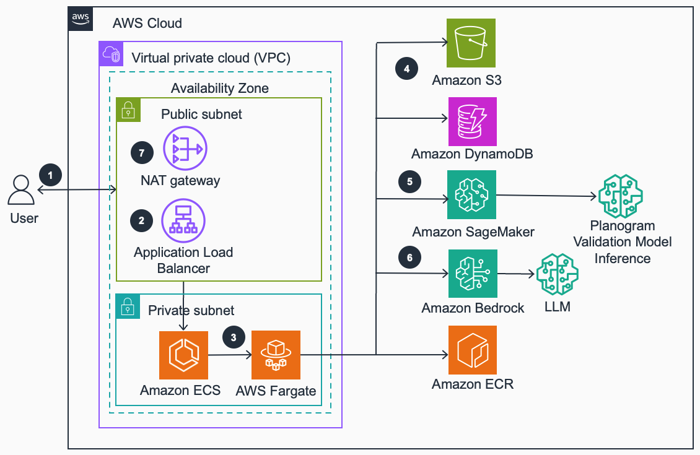

# Guidance for Planogram Management on AWS


## Table of Contents 

1. [Overview](#overview)
    - [Cost](#cost)
2. [Prerequisites](#prerequisites)
    - [Operating System](#operating-system)
3. [Deployment Steps](#deployment-steps)
4. [Deployment Validation](#deployment-validation)
5. [Running the Guidance](#running-the-guidance)
6. [Next Steps](#next-steps)
7. [Cleanup](#cleanup)
8. [Known Issues](#known-issues)
9. [Notices](#notices)
10. [Authors](#authors)

## Overview
The Planogram Management System is a comprehensive solution for optimizing retail shelf layouts using AI-driven image analysis and compliance checking.

This system allows retailers to generate, analyze, and compare planograms (visual representations of product layouts) with actual shelf images. It leverages advanced technologies like computer vision and machine learning to ensure optimal product placement and compliance with predefined rules.



### Cost

_You are responsible for the cost of the AWS services used while running this Guidance. As of April 2025, the cost for running this Guidance with the default settings in the us-west-2 Region is approximately $<n.nn> per month for processing ( <nnnnn> records )._

_We recommend creating a [Budget](https://docs.aws.amazon.com/cost-management/latest/userguide/budgets-managing-costs.html) through [AWS Cost Explorer](https://aws.amazon.com/aws-cost-management/aws-cost-explorer/) to help manage costs. Prices are subject to change. For full details, refer to the pricing webpage for each AWS service used in this Guidance._

### Sample Cost Table
The following table provides a sample cost breakdown for deploying this Guidance with the default parameters in the US-East Region for one month.
| AWS service                       | Dimensions                                                               | Cost [USD] |
| --------------------------------  | ------------------------------------------------------------------------ | ---------- |
| AWS Fargate                       | Linux, x86, 24hrs avg duration, 2 tasks/day, 20GB storage, 8GB memory    |      288.30|
| Elastic Load Balancing            | 1 load balancer                                                          |      28.11 |
| Amazon Elastic Container Registry | 4GB/month                                                                |       0.40 |
| Amazon Simple Storage Service     | Standard, 1GB/month, 1.5GB returned, 1GB scanned, 1000 each request type |       0.03 |
| Amazon DynamoDB                   | Standard table class, 1.5KB average item size, 1GB data storage size     |       0.25 |
| Amazon SageMaker                  | 10M requests/month, 5ms duration                                         |       1.00 |
| Amazon Bedrock (Anthropic Claude) | 4000 input tokens, 2000 output tokens                                    |       0.04 |
|                                   |    Total:                                                                |     318.13 |

## Prerequisites 

- Python 3.10+
- Node.js 18+
- AWS CLI configured with appropriate permissions
- Docker Desktop

### Operating System
This sample code will deploy on Linux (Amazon Linux 2). To run locally, you will need to install and run Python on your local operating system, so Linux, Windows, and MacOS are acceptable.

### Repository Structure

- `codebase/`: Contains the main application code
  * `application.py`: Main Flask application entry point
  * `Dockerfile`: Defines the container image for the application
  * `requirements.txt`: Lists Python dependencies
  * `util/`: Utility modules for planogram operations
    - `planogram_compliance.py`: Compares shelf images to planograms
    - `planogram_generation.py`: Generates planograms based on rules and metadata
    - `planogram_rules.py`: Manages planogram rules and data transformation
- `planogram-cdk/`: AWS CDK infrastructure code
  * `bin/planogram-cdk.ts`: Entry point for CDK application
  * `lib/`: Contains stack definitions for various AWS services
- `extract_*.py`: Scripts for extracting data from various AWS services
- Configuration files: `dynamodb_data.json`, `ssm_parameters.json`

### AWS CDK Bootstrap
If using aws-cdk for the first time, you will need to bootstrap your account.
<insert instructions for bootstrapping new CDK users>


## Deployment Steps

### Installation

1. Clone the repository:
   ```
   git clone <repository-url>
   cd planogram-management-system
   ```

2. Install CDK dependencies:
   ```
   cd planogram-cdk
   npm install
   ```

### Deployment


The application is deployed using AWS CDK. The `deploy-cdk.sh` script in the `planogram-cdk` directory handles the deployment process, including:

1. Bootstrapping the CDK environment
2. Synthesizing and deploying the DynamoDB stack
3. Synthesizing and deploying the S3 stack
4. Copying planogram images to the S3 bucket
5. Managing the ECR repository
6. Deploying the ECS stack with the application

After deployment, the script outputs the DNS name of the Application Load Balancer, which can be used to access the application.

There are two deployment options: deploying to an AWS-hosted website or deploying locally. To deploy to an AWS website:

1. Deploy the CDK stacks in your AWS Account:
   ```
   #Run the following command from the "planogram-cdk" directory
   #Set the environment variables
   export AWS_ACCOUNT_ID=<Your AWS Account ID>
   export AWS_REGION=<Intended AWS Region>
   export CONSUMER_PUBLIC_IP=<Public IP Address of the network>
   npm run build 
   sh -x deploy-cdk.sh
   ```

   This script will deploy the following stacks:
   - PlanogramDynamoStack
   - PlanogramS3Stack
   - PlanogramEcrStack
   - PlanogramEcsStack

2. After deployment, note the Load Balancer DNS “Planogram Demo URL” from the CDK output to access the application.


### Deploying to Run Locally

To run the application locally for development:

1. Run the Flask application:
   ```
   cd planogram-cdk
   npm install
   cdk bootstrap
   cdk synth
   cdk deploy PlanogramDynamoStack --require-approval never
   cdk deploy PlanogramS3Stack --require-approval never
   cd ../codebase
   python3 -m venv venv
   source venv/bin/activate
   pip3 install -r requirements.txt
   python3 application.py
   ```

3. Access the application at `http://localhost:8000`


### Infrastructure

The application is deployed on AWS using the following resources:

- ECS (Elastic Container Service):
  * Fargate cluster for running the application containers
  * Task definition with 8192 MB memory and 4096 CPU units
  * Fargate service with desired count of 2 tasks

- VPC:
  * Public and private subnets across 2 Availability Zones
  * NAT Gateway for outbound internet access from private subnets
  * VPC Endpoints for ECR and S3 access

- Application Load Balancer:
  * Internet-facing, distributing traffic to the ECS tasks
  * Listener on port 80, forwarding to a target group

- DynamoDB:
  * Tables for storing planogram instructions, models, rules, templates, and product metadata

- S3:
  * Bucket for storing planogram images and other static assets

- ECR (Elastic Container Registry):
  * Repository for storing the application's Docker image

### Data Flow

1. User uploads an image or selects a demo shelf image through the web interface.
2. The image is sent to the backend Flask application.
3. The application uses the YOLOv8 object detection model to identify products in the shelf image.
4. The detected products are compared against the selected planogram template.
5. Results are processed, including highlighting misplaced items and calculating compliance scores.
6. The processed results are sent back to the frontend for display.

For planogram generation:
1. User inputs instructions and selects rules.
2. The backend retrieves product metadata and applies selected rules.
3. An LLM (e.g., Claude) is used to generate planogram instructions.
4. The instructions are used to create a visual representation of the planogram.
5. The generated planogram is returned to the frontend for display.

```
[User] -> [Web Interface] -> [Flask Backend] -> [YOLOv8 Model]
                                             -> [Planogram Comparison]
                                             -> [LLM for Generation]
                                             -> [DynamoDB/S3 for data]
        <- [Results Display] <- [Processed Results]
```


## Deployment Validation
If deployed successfully, the application will be hosted at http://<Load Balancer DNS> if deployed to run on an AWS website. If running locally, it will be accessible at http://localhost:8000.
 

## Running the Guidance

### Planogram Generation
1. To generate a new planogram, provide instructions, select rules, and choose an LLM model.
2. Click "Generate Planogram" to create a new planogram based on your inputs.
3. Try various input parameter combinations to simulate various planogram ideas.

### Planogram Validation
1. Upload a shelf image or select a demo shelf image.
2. Choose a planogram template for comparison.
3. Click "Check Planogram" to analyze the shelf image against the selected planogram.
4. View the results, including the planogram, current shelf image, and highlighted misplaced items.


## Next Steps
<What other things can the user do with this? Ideas:
 - Replace LLM instructions with details related to your planogram requirements and replace images in S3 with the required products
 - Replace data used by the knowledge base to tune results
 - Train a foundational model on images of your product to generate a planogram without stored images


## Cleanup
1. Destroy the CDK stacks in your AWS Account:
   ```
   #Set the environment variables
   export AWS_ACCOUNT_ID=<Your AWS Account ID>
   export AWS_REGION=<Intended AWS Region>
   export CONSUMER_PUBLIC_IP=<Public IP Address of the network>
   cd planogram-cdk
   sh -x destroy-cdk.sh
   ```

   This script will destroy the following stacks:
   - PlanogramDynamoStack
   - PlanogramS3Stack
   - PlanogramEcrStack
   - PlanogramEcsStack
   - PlanogramSecurityStack


## Known issues

1. Image Upload Issues:
   - Ensure the image is in a supported format (JPEG, PNG)
   - Check the file size limit (typically 10MB)
   - Verify S3 bucket permissions

2. Planogram Generation Errors:
   - Check the selected rules for conflicts
   - Ensure the LLM service (e.g., Claude) is accessible
   - Verify product metadata is up-to-date in DynamoDB

3. Performance Issues:
   - Monitor ECS task CPU and memory usage
   - Check Application Load Balancer request counts and latency
   - Verify DynamoDB read/write capacity units

For detailed logs:
- Check CloudWatch Logs for the ECS tasks (stream prefix: 'planogram-app-logs')
- Review Application Load Balancer access logs


## Notices

*Customers are responsible for making their own independent assessment of the information in this Guidance. This Guidance: (a) is for informational purposes only, (b) represents AWS current product offerings and practices, which are subject to change without notice, and (c) does not create any commitments or assurances from AWS and its affiliates, suppliers or licensors. AWS products or services are provided “as is” without warranties, representations, or conditions of any kind, whether express or implied. AWS responsibilities and liabilities to its customers are controlled by AWS agreements, and this Guidance is not part of, nor does it modify, any agreement between AWS and its customers.*

## Authors
Abhijit Dutta

Wilson Thankachan
